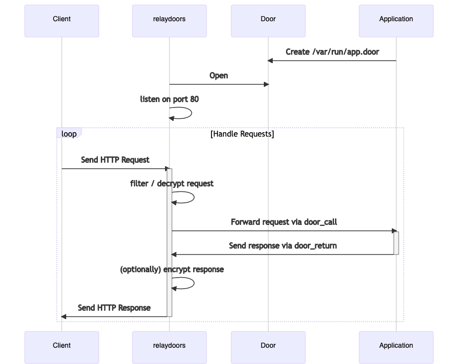

== relaydoors
_Like relayd, but with doors._

+relaydoors+ is an avant-garde application server inspired by OpenBSD's
https://github.com/openbsd/src/usr.sbin/relayd[+relayd+] and heirloom UNIX +inetd+. It listens for
an incoming networking connection, forwarding the session socket descriptor over an
https://github.com/robertdfrench/revolving-door[illumos doors] to the intended application.
+relaydoors+ maps each connected port to a door on the filesystem provided by the target
application.

.Startup and Request Handling

=== Acknowledgements
* relaydoors is inspired by OpenBSD's https://github.com/openbsd/src/usr.sbin/relayd[`relayd`].
* The social media preview image is https://www.flickr.com/photos/vergio_graffito/4623002636/[Relay Sonze] by https://www.flickr.com/photos/vergio_graffito/[Vergio Graffito].
