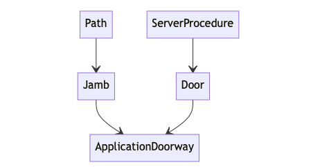

## Source Code Overview

From an application point of view, our main goal is to make illumos' Doors API
usable from Rust. There are some important caveats here: *usable* means "usable
for creating Portunus Apps", and we are only accounting for the subset of the
Doors API needed for that purpose.

This diagram shows the relationship between the major types involved in
constructing an `ApplicationDoorway`, or a connection between the application
and the `portunusd` server. Keep this diagram in mind when perusing the source
code.

