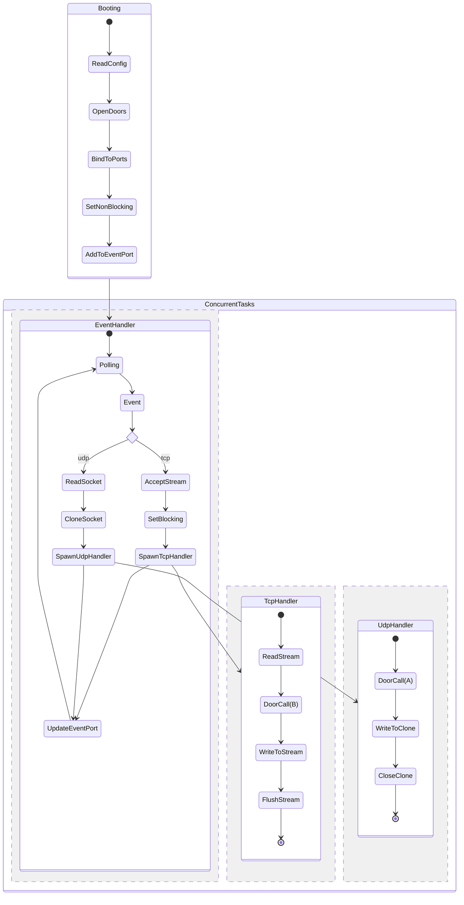

## Source Code Overview

### PortnusD State Transitions
`portunusd` begins by reading its config file (`/opt/local/etc/portunusd.conf`)
and opening all of the specified ports and doors. Each port is marked
nonblocking, and added to illumos' [event port][1] system.

As client traffic arrives, the kernel will wake up the main `EventHandler`
thread and make it aware of new events. UDP and TCP events are handled in
slightly different ways.

#### UDP Events
When a UDP event arrives, the main event handler reads any data that has already
been received by the network stack. It then clones the UDP socket, so that the
response (once it is ready) can be written by a separate thread. The client data
and the cloned socket are then handed off to a separate threadpool task called
`UdpHandler`, and we ask the [event port][1] system to keep watching for new
events related to this port.

The `UdpHandler` will invoke the door which corresponds to the port on which the
client traffic was received. Once the door's server procedure completes, the
`UdpHandler` will write the response data to its cloned copy of the UDP socket,
closing this cloned socket once the write operation is finished.

#### TCP Events
When a TCP event arrives, the main event handler accepts a `stream` object which
is immediately converted back to prefer blocking i/o. This stream is passed to a
separate threadpool task, and `portunusd` asks the [event port][1] system to
keep watching for new events related to this port.

The `TcpHandler` task will read (in a blocking fashion) input data from the
client, passing this data to the dooresponding door once the read operation is
complete. After the server procedure has returned, the response data will be
written (again, in a blocking fashion) to the `stream` object. Once all data has
been written, the stream will be flushed and closed.

<!-- REFERENCES -->
[1]: https://illumos.org/man/port_create
